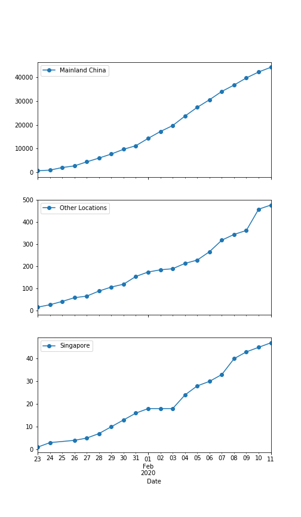

## 2019 nCov Tracking

This is a Github repository for hosting
Juypter notebooks related to the 2019 nCov

### Jupyter Notebooks (viewing only)

- [https://nathanielng.github.io/2019ncov/jupyter/01-data.html](https://nathanielng.github.io/2019ncov/jupyter/01-data.html)

### Google Colaboratory Access to Notebooks

- [http://colab.research.google.com/github/nathanielng/2019ncov](http://colab.research.google.com/github/nathanielng/2019ncov)
